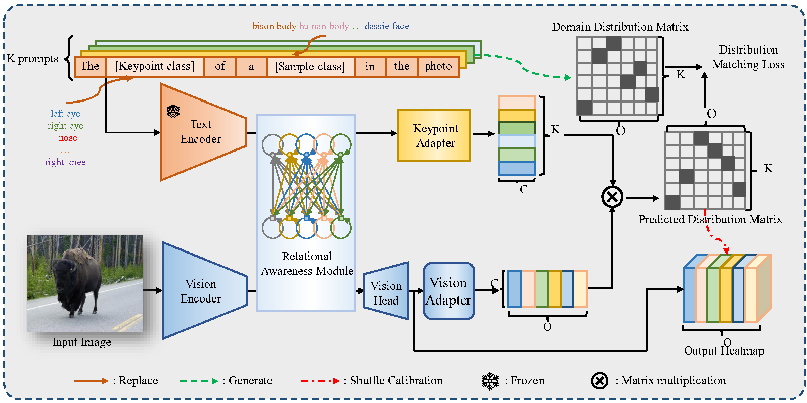

# KDSM

Official code repository for the paper:
[**Open-Vocabulary Animal Keypoint Detection with Semantic-feature Matching**](https://arxiv.org/abs/2310.05056)
[Hao Zhang, Lumin Xu, Shenqi Lai, Wenqi Shao, Nanning Zheng, Ping Luo, Yu Qiao, Kaipeng Zhang]
The email of author: zhanghao520@stu.xjtu.edu.cn.

### Abstract
Current image-based keypoint detection methods for animal (including human) bodies and faces are generally divided into fully supervised and few-shot class-agnostic approaches. The former typically relies on laborious and time-consuming manual annotations, posing considerable challenges in expanding keypoint detection to a broader range of keypoint categories and animal species. The latter, though less dependent on extensive manual input, still requires necessary support images with annotation for reference during testing. To realize zero-shot keypoint detection without any prior annotation, we introduce the **O**pen-**V**ocabulary **K**eypoint **D**etection (OVKD) task, which is innovatively designed to use text prompts for identifying arbitrary keypoints across any species. In pursuit of this goal, we have developed a novel framework named Open-Vocabulary **K**eypoint **D**etection with **S**emantic-feature **M**atching (KDSM). This framework synergistically combines vision and language models, creating an interplay between language features and local keypoint visual features. KDSM enhances its capabilities by integrating **D**omain **D**istribution **M**atrix **M**atching (DDMM) and other special modules, such as the **V**ision-**K**eypoint **R**elational **A**wareness (VKRA) module, improving the framework’s generalizability and overall performance. Our comprehensive experiments demonstrate that KDSM significantly outperforms the baseline in terms of performance and achieves remarkable success in the OVKD task. Impressively, our method, operating in a zero-shot fashion, still yields results comparable to state-of-the-art few-shot species class-agnostic keypoint detection methods. Codes and data are available at https://github.com/zhanghao5201/KDSM.



## Usage

### Data preparation
Please follow the [official guide](https://github.com/luminxu/Pose-for-Everything) to prepare the MP-100 dataset for training and evaluation, and organize the data structure properly. The images in the MP-78 dataset are consistent with MP100. 
The annotation files for MP78 are in "KDSM/annotation/". Please be aware that the annotations are intended for non-commercial use only.

### Install
Please first install pytorch and torchvision following official documentation [Pytorch](https://pytorch.org/get-started/previous-versions/). Then, run `pip install -r requirements.txt`.


## Citation
```bibtex
@article{zhang2024open,
  title={Open-vocabulary animal keypoint detection with semantic-feature matching},
  author={Zhang, Hao and Xu, Lumin and Lai, Shenqi and Shao, Wenqi and Zheng, Nanning and Luo, Ping and Qiao, Yu and Zhang, Kaipeng},
  journal={International Journal of Computer Vision},
  pages={1--18},
  year={2024},
  publisher={Springer}
}
```

## Acknowledgement

Thanks to:

- [MMPose](https://github.com/open-mmlab/mmpose)
- [Pose-for-Everything](https://github.com/luminxu/Pose-for-Everything)

## License

This project is released under the [Apache 2.0 license](LICENSE).
